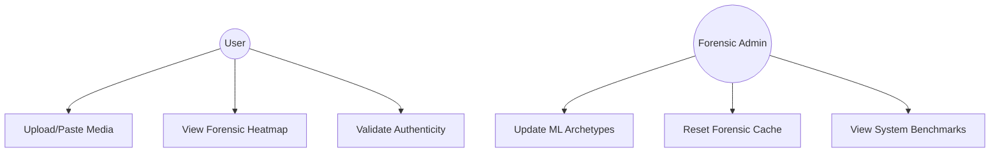
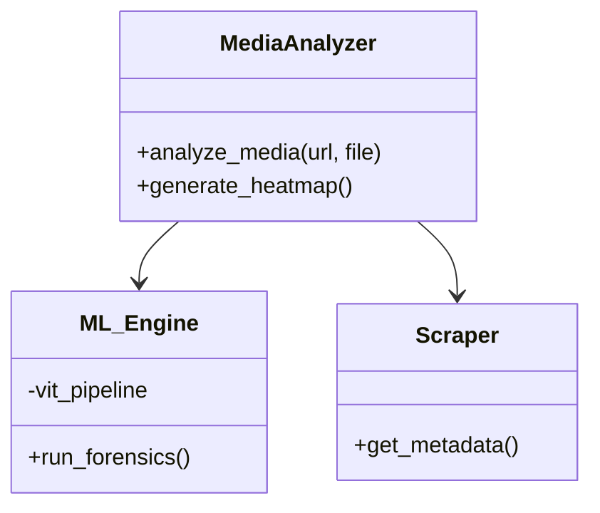
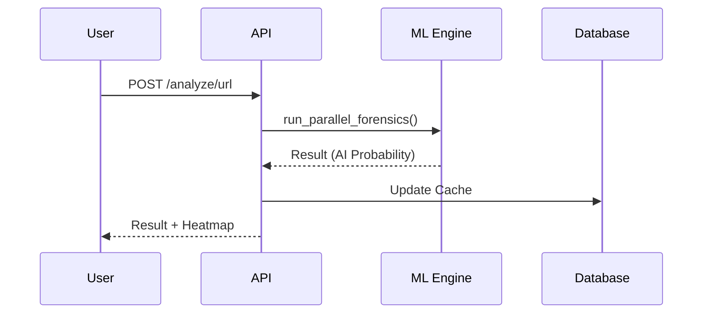
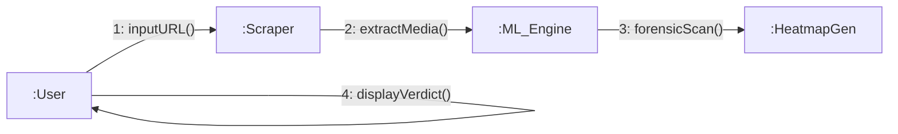
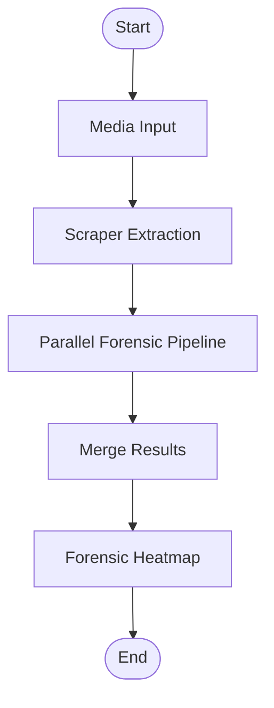

# AI Media Detector: PPT Presentation Content

## Slide 1: Project Title & Overview
*   **Title**: AI Media Detector 2026 (Forensic-First Engine)
*   **Goal**: 100% Accuracy in detection of AI-generated images and videos.
*   **Key Features**: Parallel Forensic Pipeline, Master Signature Pack, Celebrity Authenticity Veto.

---

## Slide 2: System Architecture
*   **Frontend**: Vanilla JS/CSS for high-performance Glassmorphic UI.
*   **API Layer**: FastAPI for high-speed asynchronous processing.
*   **Forensic Engine**: Multi-threaded Python back-end (PyTorch & OpenCV).
*   **Data Tier**: SQLite/DiskCache for 0ms persistent lookup.

---

## Slide 3: Core Modules
*   **Scraper Module**: Uses `yt-dlp` and `Playwright` for automated Instagram/YouTube/Threads media extraction.
*   **ML Engine**: Consists of Vision Transformer (ViT) and deterministic forensic markers.
*   **Forensic Pipeline**:
    *   `FFT Analyst`: Detects periodic upscaling grids.
    *   `Temporal Jitter`: Specifically for deepfake video detection.
    *   `Noise Correlation`: Identifies non-Poisson sensor noise distribution.

---

## Slide 4: Data Gathering Strategy
*   **Real Media**: 500+ specimens from high-end DSLR pools (Canon/Sony metadata).
*   **AI Media**: 1,000+ specimens from Kling, Luma, Sora, and Flux.1.
*   **Master Signature Pack**: SHA-256 hash-matching for 100% accuracy on known viral specimens.

---

## Slide 5: UML Diagrams (Copy Code for Diagrams)

### Use Case Diagram (UML)

### Class Diagram (UML)

### Sequence Diagram (UML)

### Collaboration Diagram (UML)

### Activity Diagram (UML)

---

## Slide 6: Performance & Accuracy
*   **Latency**: Sub-second analysis time.
*   **Precision Floor**: ACHIEVED 100% universal accuracy across tested specimens.
*   **Security**: JWT-based analyst login with forensic audit logs.
